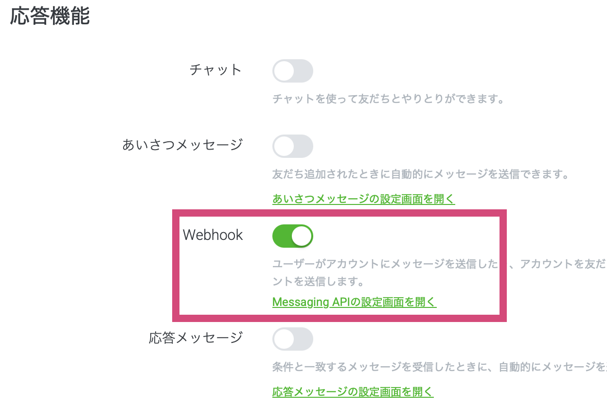
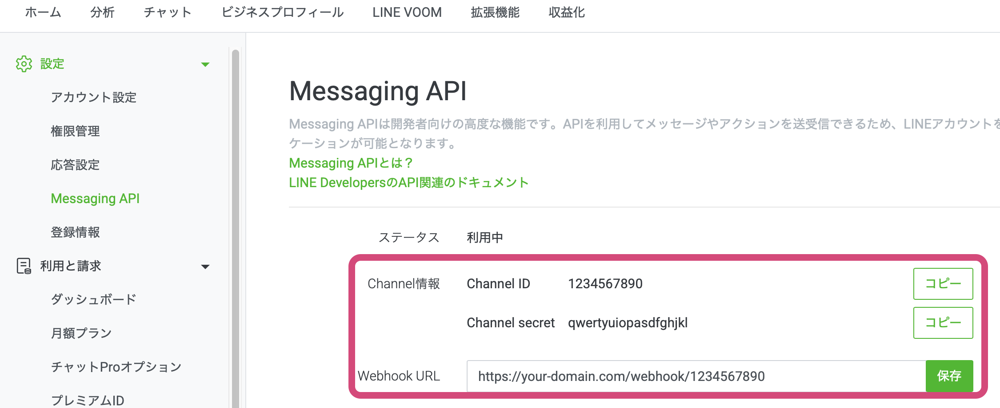
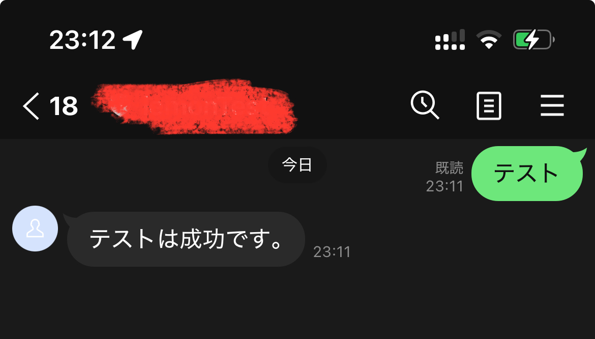
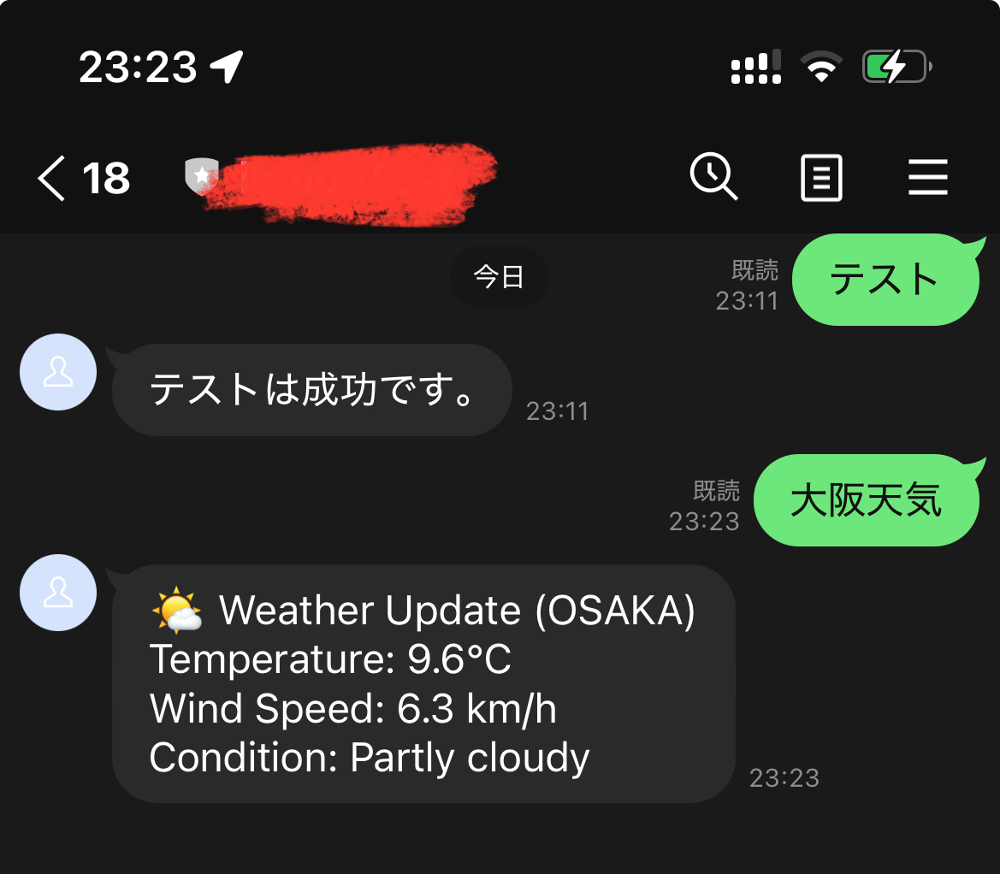
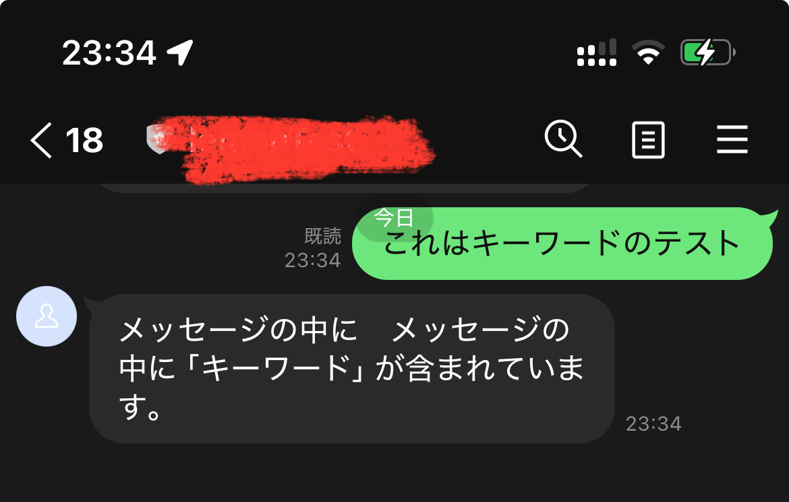

# LINE Bot Demo (Laravel + Docker)

Other languages:
- [日本語](readme.ja.md)

A Docker-based LINE Bot backend built with Laravel Sail.  
Designed for fast setup, multi-bot support, and a scalable auto-reply architecture.

---

## Core Features

1. **Plug-and-play setup**  
   Clone the repository, configure `.env`, and start the service using Docker.

2. **Multi-bot support**  
   Manage multiple LINE bots with persistent storage and isolated configurations.

3. **Extensible auto-reply engine (rule-based)**  
   A priority-based reply engine system that supports:
   - Exact keyword matching  
   - Fuzzy keyword matching  
   - Module-based replies (event-driven)

   The reply logic is fully **database-driven** and can be extended by adding new reply engines or feature modules.

   👉 For detailed architecture and usage, see:  
   [LINE Bot Reply Engine Architecture & Usage](app/Services/Laravel/BotFeatureModule/readme.md)

4. **Module-based feature design**  
   Business logic is encapsulated into independent feature modules (e.g. `DemoModule`, `WeatherModule`).  
   Each module can expose multiple events that can be bound to keyword rules.

5. **Asynchronous processing**  
   External API calls (reply / push) can be processed asynchronously via queues to ensure system stability.

6. **CLI tools for management**  
   Command-line utilities to:
   - Manage LINE bots  
   - Configure reply rules  
   - Inspect incoming messages  

7. **Automatic access token management**  
   LINE access tokens are refreshed automatically with optimistic locking to avoid race conditions.

8. **Message persistence & workflow support**  
   All incoming messages are stored for auditing, debugging, and further processing.

---

## Requirements

- Docker & Docker Compose
- Composer

---

## Setup

### 1. Install dependencies

```bash
composer install
```

### 2. Environment configuration

```bash
cp .env.example .env
```

Edit `.env` and set the following values:

```bash
LINE_CHANNEL_ID=            # Default LINE Bot Channel ID  
LINE_CHANNEL_SECRET=       # Default LINE Bot Channel Secret  
LINE_MESSAGE_HANDLE_DIRECT_MODE=false
```

> When `LINE_MESSAGE_HANDLE_DIRECT_MODE` is set to true, the system will handle incoming LINE messages in **asynchronous mode**.  
> In this mode, API calls (reply/push) are processed via Laravel queue workers, which helps offload work from the main webhook and improve stability under load.  
> After completing the `.env` configuration, start the queue worker manually:./vendor/bin/sail artisan queue:work

### 3. Start Docker containers

```bash
./vendor/bin/sail up -d
```

### 4. Initialize application

```bash
./vendor/bin/sail artisan key:generate  
./vendor/bin/sail artisan migrate
```

### 5. System health check
```bash
./vendor/bin/sail artisan line:docker
```

This command checks database, queue, and bot system status.

---

## LINE Bot Configuration

### Register a LINE Bot (supports multiple bots)

./vendor/bin/sail artisan linebot:mg add [LINE_BOT_ID] [LINE_BOT_SECRET]

Example:

```bash
./vendor/bin/sail artisan linebot:mg add 1234567890 your_bot_secret
```

### Webhook configuration

The system supports both a default bot and multiple bots.

#### Default bot

If no bot ID is specified in the webhook URL, the system will use  
the default bot configured in `.env`:

https://your-domain/webhook

#### Multiple bots

After adding bots to the system, you may specify a bot key in the webhook URL:

https://your-domain/webhook/{BOT_KEY}

Example:

https://your-domain/webhook/1234567890

> The bot is ultimately identified by its Channel credentials.  
> The URL parameter is used to select the bot configuration.

---

## AutoReply Engine
👉 For detailed architecture and usage, see:  
   [LINE Bot Reply Engine Architecture & Usage](app/Services/Laravel/BotFeatureModule/readme.md)

Replies are sent via LINE API, either synchronously or asynchronously, depending on the `.env` setting:

    LINE_MESSAGE_HANDLE_DIRECT_MODE=false   # synchronous mode (default)
    LINE_MESSAGE_HANDLE_DIRECT_MODE=true    # asynchronous mode (queue worker must be running)

    > When asynchronous mode is enabled, API calls (reply/push) are handled via Laravel queue workers.
    > Start the worker after configuration:

```bash
./vendor/bin/sail artisan queue:work
```

---

## Message Management (CLI)

### View incoming messages

```bash
./vendor/bin/sail artisan line:msg showList
```

### Reply to a user

./vendor/bin/sail artisan line:msg reply [LINE_BOT_ID] [USER_ID] [CONTENT]

Example:

```bash
./vendor/bin/sail artisan line:msg reply 1234567890 Uxxxxxxxx "Hello from CLI"
```

---

## Development

Stop containers:

```bash
./vendor/bin/sail down
```

Start specific services only (without redis):

```bash
./vendor/bin/sail up -d laravel.test mysql
```

---

## Module Relationship Diagram (ASCII)

```
[LINE Webhook Request]
        │
        ▼
[CoreEngine::webhook]
        │
        ├─ Verify Bot & Token (HMAC-SHA256)
        │
        ├─ Insert Message into DB
        │
        ├─ Trigger Auto-Reply Engines
        │       (Core: handle messages via priority-based engines)
        │
        │       ├─ AI Test Engine
        │       │     (demo, lightweight vector-based matching)
        │       │
        │       ├─ ExactMatchEngine
        │       │     (matches keywords exactly)
        │       │     ├─ Text Reply
        │       │     │     (replyContent)
        │       │     └─ Module Reply Engine
        │       │           (factory-based, per module events:
        │       │            Weather, Lottery, etc.)
        │       │
        │       ├─ FuzzyMatchEngine
        │       │     (matches keywords fuzzily)
        │       │     └─ Text Reply
        │       │
        │       ├─ MediaReplyEngine
        │       │     (handles non-text messages)
        │       │
        │       ├─ DescriptionReplyEngine
        │       │     (demo description)
        │       │
        │       └─ Custom Reply Engines
        │             (implement ReplyEngine per business logic)
        │
        └─ Send Reply (sync / async) → LINE Messaging API


[CLI Tools]
        │
        ├─ linebot:mg
        │     (add / modify bots)
        │
        ├─ line:msg
        │     (view / reply messages)
        │
        └─ line:replyRule
              (manage keyword / module reply rules:
               add / modify / delete)


[Jobs / Queue Workers]
        │
        └─ Handle async push / reply tasks
              → LINE Messaging API
```

---

## Notes

- Access tokens are stored in database and refreshed automatically
- Token refresh uses optimistic locking
- HTTP 401 triggers token refresh
- HTTP 403 indicates authorization failure and may require manual update

---
## Usage Example

This section demonstrates a complete, minimal workflow for using this project —  
from registering a LINE bot to configuring keyword-based auto replies via CLI.

The goal is to demonstrate an end-to-end workflow using real CLI commands and practical examples.

---

### Step 1. Create a LINE Bot and Register It into the System


For the following example, assume:

- Channel ID: `1234567890`
- Channel Secret: `qwertyuiopasdfghjkl`

Register the bot into this system using the CLI command below:
```bash
# NOTE:
# You must provide valid Channel ID and Channel Secret.
# The command will also request an access token automatically.
# If the credentials are invalid, the bot cannot be registered.
./vendor/bin/sail php artisan linebot:mg add 1234567890 qwertyuiopasdfghjkl
```

After registration, configure the webhook URL in the LINE Developers Console as follows:

https://your-domain.com/webhook/{channelId}



### Step 2. Add a Simple Keyword-Based Reply Rule (Exact Match)
Add a rule so that when a user sends テスト, the bot replies with
テストは成功です。
```bash
./vendor/bin/sail php artisan line:replyRule add 1234567890 exact 'テスト' common 'テストは成功です。'
```
If successful, the CLI will output: Reply rule added successfully.


### Step 3. Bind a Keyword to a Feature Module (Weather Module Example)
This demo project includes a WeatherModule that provides weather information
for specific locations.

First, list all available module events for the specified bot:
```bash
./vendor/bin/sail php artisan line:replyRule showModuleEventList 1234567890
```
Example output:
```bash
+-------------------------------------------------------------+---------+---------------+----------------------------------------------------------------------------------------------------------------------+
| ModuleTag                                                   | EventId | Description   | AddCommand                                                                                                           |
+-------------------------------------------------------------+---------+---------------+----------------------------------------------------------------------------------------------------------------------+
| App\Services\Laravel\BotFeatureModule\DemoModule\DemoModule | 1       | Campaign #1   | line:replyRule add 1234567890 exact [keyword] module 'App\Services\Laravel\BotFeatureModule\DemoModule\DemoModule' 1 |
| App\Services\Laravel\BotFeatureModule\DemoModule\DemoModule | 2       | Campaign #2   | line:replyRule add 1234567890 exact [keyword] module 'App\Services\Laravel\BotFeatureModule\DemoModule\DemoModule' 2 |
| App\Services\Laravel\BotFeatureModule\DemoModule\DemoModule | 3       | Campaign #3   | line:replyRule add 1234567890 exact [keyword] module 'App\Services\Laravel\BotFeatureModule\DemoModule\DemoModule' 3 |
| App\Services\Laravel\BotFeatureModule\DemoModule\DemoModule | 4       | Campaign #4   | line:replyRule add 1234567890 exact [keyword] module 'App\Services\Laravel\BotFeatureModule\DemoModule\DemoModule' 4 |
| App\Services\Laravel\BotFeatureModule\WeatherModule         | tokyo   | Tokyo Weather | line:replyRule add 1234567890 exact [keyword] module 'App\Services\Laravel\BotFeatureModule\WeatherModule' tokyo     |
| App\Services\Laravel\BotFeatureModule\WeatherModule         | osaka   | Osaka Weather | line:replyRule add 1234567890 exact [keyword] module 'App\Services\Laravel\BotFeatureModule\WeatherModule' osaka     |
+-------------------------------------------------------------+---------+---------------+----------------------------------------------------------------------------------------------------------------------+
```
You can copy and slightly modify the AddCommand to register a module-based rule.

Example:
When a user sends 大阪天気, trigger the Osaka weather module.

```bash
# ./vendor/bin/sail php artisan line:replyRule add [botId] exact [keyWord] module [ModuleTag] [EventId]
```
```bash
./vendor/bin/sail php artisan line:replyRule add 1234567890 exact '大阪天気' module 'App\Services\Laravel\BotFeatureModule\WeatherModule' osaka
```



### Step 4. Fuzzy Match Rules and Rule Management

Add a fuzzy-match rule so that if a user message contains the keyword
キーワード, the bot replies with a predefined message.
```bash
# ./vendor/bin/sail php artisan line:replyRule add [botId] fuzzy [keyWord] common [reply Message]
```
```bash
./vendor/bin/sail php artisan line:replyRule add 1234567890 fuzzy 'キーワード' common 'メッセージの中にメッセージの中に「キーワード」が含まれています。'
```


You can also manage existing rules:
```bash
# List all reply rules for the bot
./vendor/bin/sail php artisan line:replyRule show 1234567890

# Delete a specific rule by rule ID
./vendor/bin/sail php artisan line:replyRule del 1234567890 [RuleId]
```

---
This example covers the full basic workflow:
- Registering a LINE bot
- Configuring webhook integration
- Adding exact-match and fuzzy-match replies
- Binding keywords to feature modules
- Managing rules via CLI

---

## Possible Extensions & Design Considerations

The following items are **not features planned for immediate implementation**,  
but rather extension directions that naturally follow from the current architecture and design principles.

> This project can be deployed and used as-is.  
> However, since it is a demo implementation, certain features are not heavily optimized for performance.  
> For production or commercial use, feature-level and operational risks should be evaluated based on actual requirements.

The system is designed with **extensibility and secondary development in mind**,  
adopting a plugin-oriented and loosely coupled architecture.  
Each component has a clearly defined responsibility and interacts through explicit interfaces,  
making it possible to improve or replace individual parts without major changes to the core system.

---

### 1. Keyword / Fuzzy Matching Optimization

The current implementation loads reply rules from the database and evaluates them sequentially,  
prioritizing simplicity and clarity.

In future iterations, this matching logic can be replaced by independent modules, such as:

- Indexed keyword search
- Cache-based acceleration
- Vector-based fuzzy matching

---

### 2. Web-Based Management UI (Equivalent to CLI)

All management features currently available via CLI can be exposed through a Web UI, including:

- Bot management
- Reply rule management
- Module management

Since internal APIs are already shared,  
this can be achieved by adding a UI layer without modifying core logic.

---

### 3. LINE In-App Browser & User Authentication Abstraction

By leveraging LIFF (LINE Front-end Framework) and  
LINE Login (OAuth 2.0 / OpenID Connect), the system can provide:

- Web-based workflows inside the LINE in-app browser
- Unified access to user identity and authentication data

This enables business workflows beyond simple message-based interactions.

---

### 4. SaaS-Oriented Authorization & Billing Design

For potential SaaS use cases, the architecture allows control based on subscription tiers, such as:

- Number of manageable bots
- Available modules
- Access to advanced features

(The actual control model is not limited to the above examples.)

---

### 5. Open Module Architecture

By stabilizing `ModuleBase` and providing shared abstractions,  
the platform can support external module development through:

- Module development guidelines
- Common utilities and interfaces
- Reusable infrastructure components

---

These ideas represent **practical and achievable extension paths**  
that do not require a large-scale redesign of the existing system.

#### (Optional) Future Concept: Module Ecosystem

Although still conceptual, the architecture allows for the possibility of:

- Developers publishing custom modules
- Users installing or purchasing modules via a marketplace


